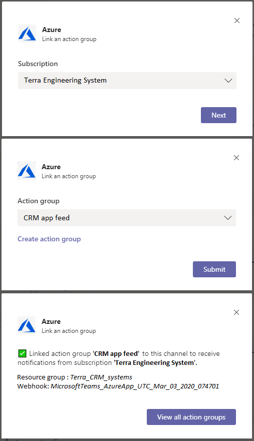

# Azure with Microsoft Teams
If you use [Microsoft Teams](https://products.office.com/microsoft-teams/group-chat-software), you can use the Azure app for Microsoft Teams to easily monitor your applications and infrastructure on Azure. Link action groups of your choice with a channel and get notified on the alerts.


## Prerequisites & limitations
Being a private preview, Azure app has certain limitations as detailed below. We will continue to invest in the app to remove some of these constraints.

> [!NOTE]
> * The app posts notifications for metric alerts. Support for 'activity log' and 'log alerts' will added soon.
> * Alerts with multiple conditions or a single metric alert with multiple dimensions are not supported.
> * Need to add a point on user id in ADO. WIll have to frame accordingly. 


## Add the Azure app to your team
Download the [manifest](https://google.com) and upload it as a custom app and install it to the team of your choice. 
> 

Upon installing, a welcome message is displayed as shown in the following image. Use the @azure handle to start interacting with the app.
> 


## Link your channel to action groups 

1. Once the app is installed in your team, authenticate yourself to Azure app using the @azure signin command.

> 
> 
> 

2. To view, link and unlink actions groups for a channel, use the following command:

  ```
   @azure actionGroups
  ```
  The `actionGroups` command lists all the action groups linked to the channel. It also helps users to link and unlink action groups.

> 

3. Click on 'Link an action group' button. Select a subscription and the action group that you want to link to the channel.

> 

  To link an action group to a channel, one must be part of Azure Monitor Contributor group. When an action group is linked to a channel a webhook action will be created with the name Azure_Microsoft_Teams_<Time_stamp> for the linked action group. 

## Unlink an action group
Run `actionGroups` command. Click on 'View all action groups' button and select the action group that you want to unlink.

> 

To unlink an action group, one must be part of Azure Monitor Contributor group. 

## Receiving notifications
Once an action group is linked to a channel, all alerts sent to this action group will be directed to the channel in the form of notifications.

> 

For metric alerts, if the user who linked the action group has access to the resource group for which the alert was sent, a graph would be rendered.

## Command reference

The following table lists all the commands you can use in your Microsoft Teams channel.

|Command	| Functionality |
| -------------------- |----------------|
| @azure actionGroups	| View,  link or unlink action groups for this channel |
| @azure signin	| Sign in to your Azure account |
| @azure signout	| Sign out from your Azure account |
| @azure feedback	| Report a problem or suggest a feature |


## Future work
We’re constantly at work to improve the app, and soon you’ll see new features stated below

> * Support for activity and log alerts
> * Ability to acknowledge and close an alert from the channel (change alert state)
> * Ability to get pipeline deployment data (for virtual machines only)
> * Threading of notifications

## Troubleshooting

1) For metric alerts, the cards are not enriched with time charts
Possible cause: The user who linked the action group does not have access to the resource for which the alert was fired.


